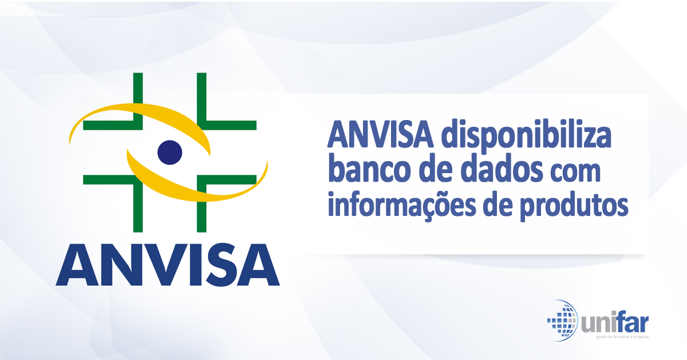

Preços de Medicamentos - Consumidor
Os dados representam a lista de preços de Medicamentos , contemplando o preço Fábrica, ou preço fabricante (PF), que é o preço máximo que pode ser praticado pelas empresas produtoras ou importadoras do produto e pelas empresas distribuidoras. O PF indica o preço máximo permitido para venda a farmácias e drogarias e o Preço Máximo ao Consumidor (PMC) indica o preço teto de venda ao consumidor.

Fonte de dados: https://dados.anvisa.gov.br/dados/

